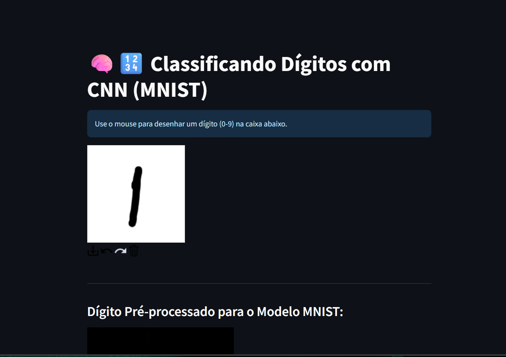
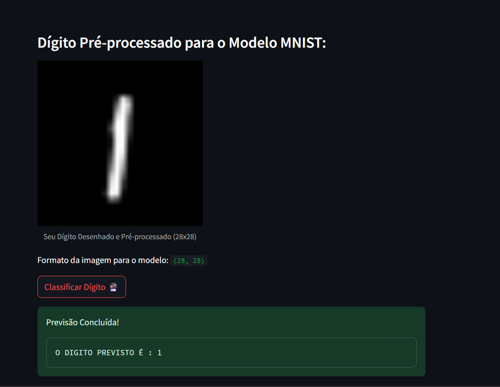

# 🧠🔢 Classificação de Dígitos Manuscritos com CNN (MNIST)

link para o projeto : https://digitos-mnist-rayssa-snt.streamlit.app/

Este projeto em Streamlit permite que você desenhe um dígito (0–9) diretamente na tela e o classifique usando uma rede neural convolucional (CNN) treinada com o dataset MNIST.

## 💡 Funcionalidades

- Interface interativa para desenhar dígitos.
- Pré-processamento da imagem desenhada.
- Classificação em tempo real usando PyTorch.
- Visualização do dígito pré-processado.

## 📸 Interface

## 🧠 Sobre o Modelo
O modelo de rede neural convolucional (CNN) utilizado neste projeto foi desenvolvido, treinado e ajustado por mim especificamente para este aplicativo. Ele foi treinado com o dataset MNIST usando PyTorch, com foco em precisão e simplicidade para execução local.

A arquitetura da rede CNN segue este padrão:

- 2 Camadas convolucionais
- Camada de dropout
- 2 Camadas totalmente conectadas
- Função de ativação ReLU e Softmax final

# 🛠️ Tecnologias
- Streamlit
- PyTorch
- OpenCV
- PIL (Pillow)
- NumPy
